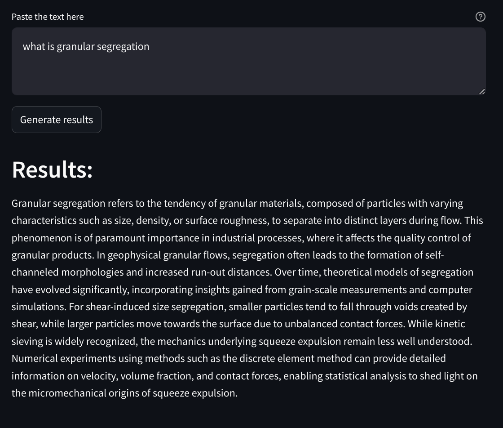
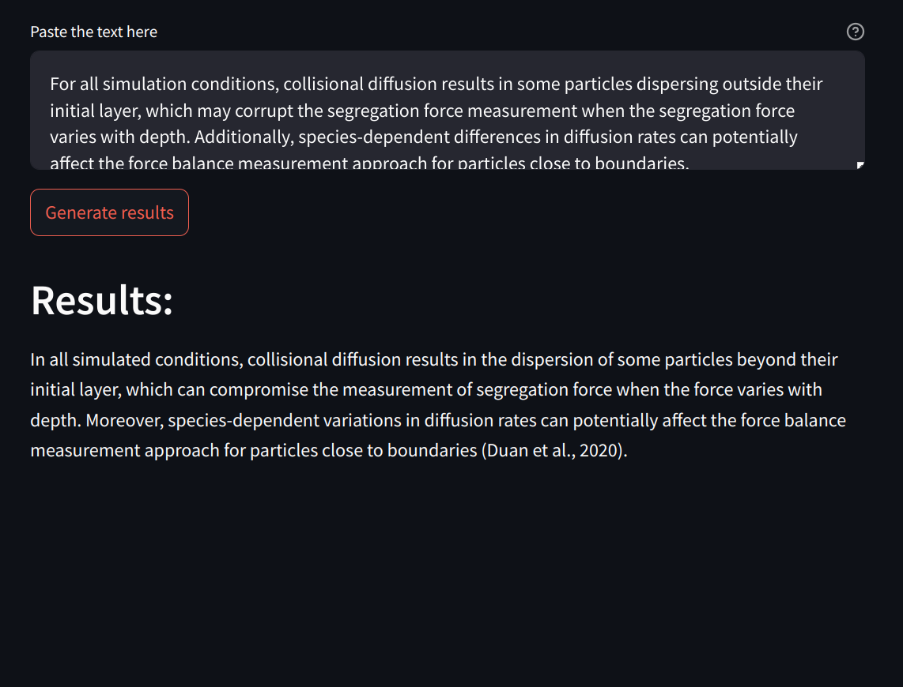

# LLM paper writing

[](https://llmpaperwriting.streamlit.app/)
[](https://github.com/19revey/LLM_paper_writing/blob/main/LICENSE)


This AI model is designed to assist in generating scholarly content for academic papers in selected areas. It embeds queries to retrieve highly similar text chunks from relevant papers, using these documents to craft responses.

**Warning:** References might not be included in the response. Ensure all content is properly cited for publication purposes.


<!-- Image 1 -->
<p align="center">
  <br>
  <em>Brief, question-style prompt for Q&A</em>
</p>

<!-- Image 2 -->
<p align="center">
  <br>
  <em>Long paragraph prompt to rephrase</em>
</p>


## Features
- **Paragraph Generation**: Automatically generates text for academic papers based on given prompts.
- **Customization**: Ability to fine-tune the model on specific topics or styles.
- **Free to use**: Powered by the latest Gemini 1.5 pro. While there is a limit on request frequency, it is currently free.
- **Secure**: The code is open source, and uploaded PDF files are stored on Astra DB for persistence.


*Source: [Gradient Flow](https://gradientflow.com/best-practices-in-retrieval-augmented-generation/).*

## Getting Started

- The app is hosted on streamlit cloud: [https://llmpaperwriting.streamlit.app/](https://llmpaperwriting.streamlit.app/)

- To run it locally, start by configuring the necessary environmental variables:
```bash
  - GOOGLE_API_KEY
  - ASTRA_DB_ID
  - ASTRA_DB_APPLICATION_TOKEN=
```
- Next, clone this repository and launch the container:
```bash
    docker compose up
```

## Next
- Removing near duplicates in semantic search retrieval using hashing techniques
- Web scraping online publications
